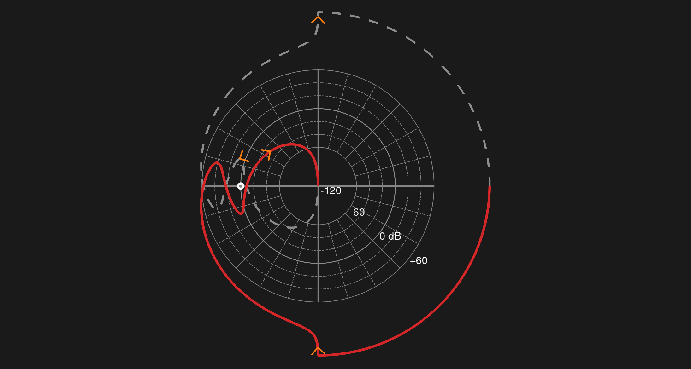

# Nyquist plot with logarithmic amplitudes

This is a port of Trond Andresen's MATLAB version[^1] for GNU Octave. To use it
the control package[^2] need to be installed.

[^1]: Trond Andresen (2026). Nyquist plot with logarithmic amplitudes
    [https://www.mathworks.com/matlabcentral/fileexchange/7444-nyquist-plot-with-logarithmic-amplitudes](https://www.mathworks.com/matlabcentral/fileexchange/7444-nyquist-plot-with-logarithmic-amplitudes), MATLAB Central File Exchange. Retrieved May 1, 2026. 

[^2]: GNU Octave - The 'control' package. [https://gnu-octave.github.io/packages/control/](https://gnu-octave.github.io/packages/control/)

<div style="text-align: center;">
    
    <p align="center"><em>Nyquist plot with logarithmic amplitudes</em></p>
</div>

## Quick start

Place the file `nyqlog.m` in Octave's path. See
[https://docs.octave.org/v11.1.0/Manipulating-the-Load-Path.html](https://docs.octave.org/v11.1.0/Manipulating-the-Load-Path.html).
Then load the control package [^2] and define a transfer function. Finally call
the `nyqlog` function passing as argument the transfer function.

```shell
octave:1> pkg load control
octave:2> sys = zpk([-1/3 -1/2], [0 -0.02 -0.1 -2 -10], 48)

Transfer function 'sys' from input 'u1' to output ...

                     48 s^2 + 40 s + 8
 y1:  ------------------------------------------------
      s^5 + 12.12 s^4 + 21.44 s^3 + 2.424 s^2 + 0.04 s

Continuous-time model.
octave:3> nyqlog(sys)
```
